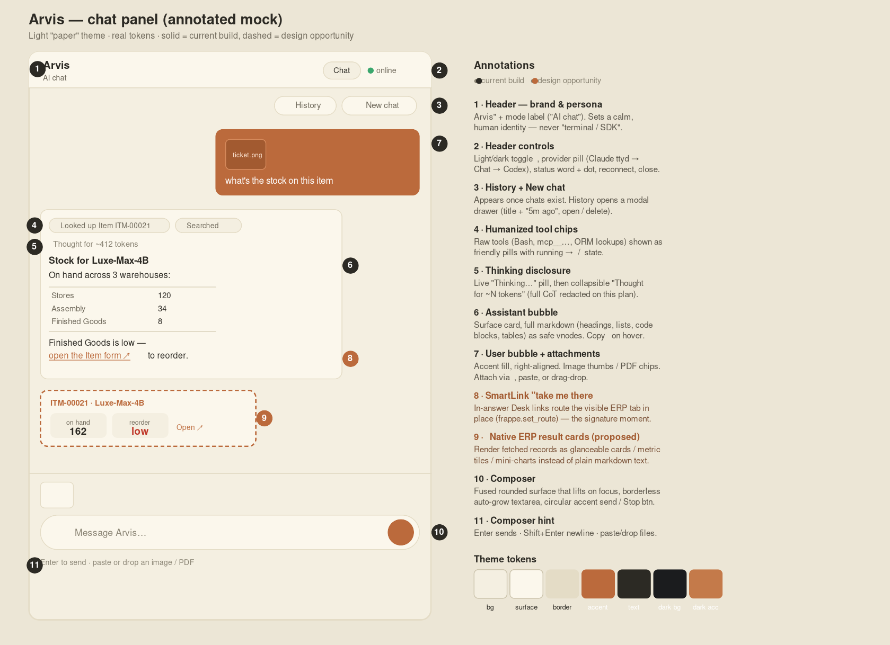

# claude-desk-sidebar

A chat interface built **on top of Claude Code** (via the Claude Agent SDK) for the
Frappe/ERPNext **Desk** right sidebar. Instead of an embedded terminal, employees get a
real chat: streaming replies, markdown, resolved tool-call chips, a thinking indicator,
screen-aware answers, record links that move the Desk in place, image/PDF/spreadsheet
upload, multi-chat history, and Stop.

> Key idea: this is **not** the raw Anthropic API. It runs the *same agent as the
> `claude` CLI* (its tools, file access, and `CLAUDE.md` project context) as a library,
> and only swaps the transport — PTY/terminal → a small WebSocket server → a custom UI.

```
browser chat UI  →  WebSocket  →  Node chat-server  →  Claude Agent SDK  →  Claude Code  →  Claude LLM
   (frontend/)                       (server/)         @anthropic-ai/claude-agent-sdk
```

## UI at a glance



*Annotated mock of the chat panel (numbered callouts in [`docs/chat-mock-annotated.svg`](docs/chat-mock-annotated.svg)). Solid = shipping; dashed = a flagged design opportunity.*

## Features
- **Streaming** assistant text + **markdown** (code blocks w/ copy, tables, lists, links).
- **Tool chips** that resolve to ✓/✗ with human labels ("Ran a command", "Looked up Item ITM-1").
- **Thinking** indicator + token estimate (chain-of-thought text is redacted on the
  subscription login; the UI auto-fills it if a richer auth ever exposes it).
- **Stop** a long turn (streaming-input mode → `query.interrupt()`).
- **Screen-aware**: every message carries a Desk-context snapshot so "this"/"here" resolve.
- **Desk-aware links**: record links navigate the Desk in place via `frappe.set_route`.
- **Attachments**: paste (Ctrl+V), drag-drop, or pick. Images and PDFs go inline as
  base64 blocks (vision); **spreadsheets/docs/text (xlsx, csv, docx, txt, md, log, tsv,
  json) are extracted to text/markdown on the server** (SheetJS + mammoth; JSON is
  pretty-printed) before the turn, so the model reads their contents. Caps + friendly
  rejection notices.
- **Multi-chat history** in `localStorage` (multi-tab-safe), browsable drawer, resume on
  reload; image previews persisted in **IndexedDB** so they survive a reload.
- **Auto-reconnect** with backoff; operator-friendly "reconnecting…" — never a stack trace.
- Light/dark theme with a warm clay accent.

## Repo layout

| Path | What it is |
|------|------------|
| `server/chat-server.mjs` | The runtime. WebSocket server (port 7683) wrapping the Agent SDK; relays a small JSON protocol. |
| `server/lib.mjs` | Pure helpers (context preamble, tool labels, multimodal content builder) — unit-tested. |
| `server/test/lib.test.mjs` | `node --test` suite for `lib.mjs`. |
| `server/package.json` | Deps: `@anthropic-ai/claude-agent-sdk`, `ws`, `xlsx` + `mammoth` (attachment extraction). |
| `server/test/fixtures/sample.docx` | Fixture for the docx-extraction test. |
| `docs/chat-mock-annotated.*` | Annotated UI mock (png + svg). |
| `frontend/chat-panel.js` | **Reference snapshot** of the chat UI (Preact) — lives inside the host app's bundle. |
| `frontend/chat-panel.css` | Chat / markdown / history / attachment styles (themed). |
| `frontend/sena_chat_store.mjs` | Multi-chat history store (localStorage), multi-tab-safe. |
| `frontend/sena_chat_idb.mjs` | IndexedDB store for image-attachment previews. |
| `frontend/sena_chat_store.test.mjs` | `node --test` suite for the store. |
| `examples/sena-chat-claude.service` | systemd `--user` unit that keeps the server running. |

## Wire protocol

Client → server: `{ type: "send", text, context, attachments[] }`, `{ type: "stop" }`,
`{ type: "new" }`, `{ type: "resume", session }`.

Server → client: `text`, `thinking_start` / `thinking` / `thinking_tokens`,
`tool` / `tool_done`, `compacted` (history auto-summarized to stay under the context
window), `done` (carries session id), `session_reset`, `error`.

Multi-turn memory uses the SDK's `resume`; an expired session is detected and the server
transparently retries in a fresh session (`session_reset`).

## Running the server

Requires Node 18+ and the `claude` CLI installed **and logged in** (the SDK inherits that
login from `~/.claude` — no API key needed).

```bash
cd server
npm install
node chat-server.mjs        # ws://127.0.0.1:7683
```

It sets cwd to `../context` to load that folder's `CLAUDE.md`; designed to run inside the
host app at `apps/<app>/tools/sena_sidebar_claude/server/`. Adjust `CONTEXT_DIR` otherwise.

### Run as a service (Linux)
```bash
cp examples/sena-chat-claude.service ~/.config/systemd/user/
# edit WorkingDirectory/ExecStart paths to match your machine
systemctl --user daemon-reload
systemctl --user enable --now sena-chat-claude
journalctl --user -u sena-chat-claude -f
```

## Tests

From a clean clone (server deps are needed because the extractor tests load `xlsx`):

```bash
cd server && npm install && node --test        # 16 tests — helpers + attachment extraction
cd ../frontend && node --test                   # 8 tests — history store (no deps)
```

Both suites are dependency-light `node:test` and run without a browser or a live agent.

## Integration with the Frappe app
The `frontend/` code ships from inside the host app's asset bundle
(`sena_ai_sidebar.bundle.js`), built by Frappe's esbuild:
1. `sena_ai_sidebar.config.js` → `window.senaAiSidebarConfig.chatUrl = "ws://127.0.0.1:7683"`.
2. A provider `{ key: "claude-chat", kind: "chat", url: chatUrl }` renders `<ChatPanel/>`.
3. `hooks.py` `app_include_js` / `app_include_css` ship the bundle into Desk.
4. `bench build --app <app>` rebuilds after changes.

## Security
- **Origin-locked WebSocket.** The server binds `127.0.0.1`, but because the agent can run
  shell commands, it also rejects cross-site browser connections (CSWSH / DNS-rebinding):
  only the local Desk (`localhost` / `127.0.0.1` / `*.localhost`) and origins listed in
  `SENA_CHAT_ALLOWED_ORIGINS` (comma/space separated; `*` disables the check) may connect.
  Non-browser clients (no `Origin` header) are allowed.
- **Input cap.** User text is capped per turn (`MAX_MESSAGE_CHARS`); attachments have their
  own size/count caps.
- Still single-trusted-operator by design: add **per-connection auth + tool/scope
  restrictions** before any multi-user deployment.

## Notes
- Auth is the existing Claude Code subscription login; nothing billed per-token, no key in this repo.
- `frontend/` is a reference snapshot, not a standalone build — `preact` is provided by the host bundle.

## License

Proprietary — internal Sena / Avinash Industries tooling. Not licensed for redistribution
or external use (`package.json` → `UNLICENSED`).
